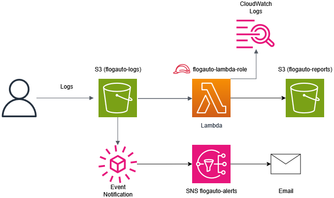

# 🧠 FLogAuto — Automated Forensic Log Analyzer (AWS Serverless)

## 📘 Descripción general
**FLogAuto** es un sistema *serverless* diseñado para automatizar el análisis forense de logs en la nube.  
Detecta patrones de ataque (SQLi, XSS, Brute Force) y genera informes HTML con alertas automáticas por correo.

Desarrollado como simulación de un entorno **SOC L1 (detección y respuesta inicial ante incidentes)**, implementado íntegramente con servicios nativos de AWS.

---

## ⚙️ Arquitectura

**Servicios principales:**
- 🪣 **S3** → Almacenamiento de logs (`flogauto-logs`) y reportes (`flogauto-reports`).
- ⚡ **Lambda (Python 3.9)** → Procesamiento y análisis de los logs.
- 📣 **SNS** → Envío de alertas de seguridad por correo.
- 🔒 **IAM** → Permisos mínimos para S3, SNS y CloudWatch.
- 🧩 **CloudWatch** → Monitoreo de ejecución y depuración.

## 🏗️ Arquitectura del Proyecto

## 🧠 Flujo resumido
1. Subes un archivo `.log` a `s3://flogauto-logs/incoming/`
2. Lambda se activa y analiza el archivo.
3. Si detecta coincidencias, genera un informe HTML.
4. Se envía una alerta por correo mediante SNS.

---

## 🧩 Patrones detectados

| Tipo de ataque   | Expresión Regular                             | Ejemplo detectado |
|------------------|-----------------------------------------------|-------------------|
| SQL Injection    | `select|union|insert|drop|delete`             | `UNION SELECT user,pass FROM admin` |
| XSS              | `` |
| Brute Force      | `401 Unauthorized|Invalid password|login`     | `401 Unauthorized` |

---

## 🔧 Despliegue paso a paso (CLI)

1. Crear los buckets

aws s3api create-bucket --bucket flogauto-logs --region eu-west-1 --create-bucket-configuration LocationConstraint=eu-west-1

aws s3api create-bucket --bucket flogauto-reports --region eu-west-1 --create-bucket-configuration LocationConstraint=eu-west-1
  
2. Crear y suscribirse a SNS
aws sns create-topic --name flogauto-alerts --region eu-west-1
ARN: arn:aws:sns:eu-west-1:850017502340:flogauto-alerts

aws sns subscribe --topic-arn arn:aws:sns:eu-west-1:850017502340:flogauto-alerts --protocol email --notification-endpoint awsjowi@gmail.com --region eu-west-1

3. Crear política de IAM con permisos mínimos
aws iam create-policy --policy-name flogauto-policy --policy-document file://flogauto-policy.json

4. Crear ROL para Lambda
aws iam create-role --role-name flogauto-lambda-role --assume-role-policy-document file://trust-policy.json

    Confianza: Se le adjuntó una Política de Confianza que permite al servicio AWS Lambda (lambda.amazonaws.com) asumir este rol.

5. Enlazar rol con políticas

aws iam attach-role-policy --role-name flogauto-lambda-role --policy-arn arn:aws:iam::aws:policy/service-role/AWSLambdaBasicExecutionRole

    Logs (AWS-Managed): Se le adjuntó la política AWSLambdaBasicExecutionRole para permitir que la Lambda escriba sus logs de ejecución en CloudWatch.

aws iam attach-role-policy --role-name flogauto-lambda-role --policy-arn arn:aws:iam::850017502340:policy/flogauto-policy

    Permisos de Aplicación (Custom): Se le adjuntó tu política personalizada, flogauto-policy, que define las interacciones de tu código con S3 y SNS.

6. Crea una carpeta lambda_src y dentro un archivo flogauto_analyzer.py

7. Crear función Lambda

aws lambda create-function --function-name flogauto-analyzer --runtime python3.9 --role arn:aws:iam::850017502340:role/flogauto-lambda-role --handler flogauto_analyzer.lambda_handler --zip-file fileb://lambda_src.zip --timeout 60 --memory-size 512 --region eu-west-1

        El Handler es el punto de entrada de la función AWS Lambda; es la porción de código que AWS invoca cuando se activa tu función.

        El formato del handler sigue esta estructura:
        <nombre_archivo_python>.<nombre_funcion_a_ejecutar>

        Timeout de 60 segundos permite procesar archivos grandes.

ARN: arn:aws:lambda:eu-west-1:850017502340:function:flogauto-analyzer

8. Dar permiso a S3 para que pueda invocar a Lambda
Listar buckets: aws s3api list-buckets

aws lambda add-permission --function-name flogauto-analyzer --statement-id s3invoke-flogauto --action "lambda:InvokeFunction" --principal s3.amazonaws.com --source-arn arn:aws:s3:::flogauto-logs --region eu-west-1

9. Crear la notificación de S3

aws s3api put-bucket-notification-configuration --bucket flogauto-logs --notification-configuration file://notificacion.json

10. Subir logs de prueba

Ejemplo: echo '192.168.1.1 - - [05/Nov/2025:17:40:00 +0000] "POST /login.php HTTP/1.1" 401 Unauthorized 1234' | Out-File -Encoding ASCII test-final-run.log

Subir a S3: aws s3 cp test-apache-brute.log s3://flogauto-logs/incoming/test-final-run.log
